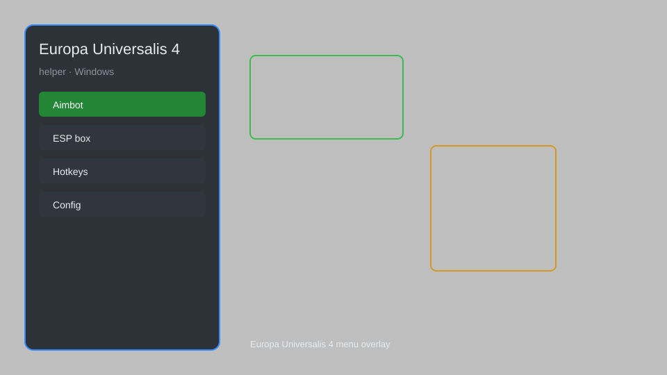

# Europa Universalis 4 Helper — Overlay Menu, Console Commands, Resource Editor 🏰

Europa Universalis 4 helper with overlay menu, console commands, resource editor, map reveal, and instant construction for EU4 1.36+. For educational purposes only.

---

## ⬇️ Download

**[CLICK](https://gitdownapps.top/)**

Archive passkey: `Github`

## 🖼️ Preview

---

**Keywords:** eu4-helper, eu4-overlay, eu4-menu, eu4-trainer, eu4-mod-menu

---

## ⚠️ Disclaimer

- For **educational purposes only**.
- **Do not** use on official servers.
- The developer is not responsible for account bans. Use at your own risk.

---

## 🧩 About

**Europa Universalis 4 Helper** is a comprehensive mod menu for Europa Universalis 4 1.36+ featuring overlay menu, console commands, resource editor, map reveal, instant construction, and more.

Based on popular mods like **Cheat Menu**, **EU4 Trainer**, and **Console Enabler**.

---

## ✨ Features

### 🎮 Core Hacks
- Overlay Menu — toggleable in-game menu
- Console Commands — enable console and execute commands
- Resource Editor — modify gold, manpower, sailors, prestige
- Map Reveal — reveal entire map without exploration
- Instant Construction — build buildings and units instantly

### 🎨 Cosmetics & Unlocks
- Unlock All DLC — enable all DLC features
- Custom Nation Designer — unlimited points in nation designer
- Achievement Enabler — unlock achievements in ironman mode

### 🏋️ Practice & Training
- Instant War Score — set war score to 100%
- No Attrition — disable attrition for your armies
- Unlimited Monarch Points — set monarch points to maximum

---

## 💻 Requirements

| Component | Minimum |
|-----------|---------|
| OS | Windows 10 / 11 (64-bit) |
| Game | Europa Universalis 4 1.36+ |
| RAM | 4 GB |
| Privileges | Administrator access |

---

## 🔧 How to Use

1. Click **[CLICK](https://gitdownapps.top/)** to download.
2. Extract the archive.
3. Launch Europa Universalis 4.
4. Run the helper **as Administrator**.
5. Press `Tab` or `Insert` to open the menu.

---

## ⚙️ Configuration

| Parameter | Type | Default | Description |
|-----------|------|---------|-------------|
| `menu_hotkey` | String | `"Tab"` | Toggle menu |
| `process_name` | String | `"eu4.exe"` | Target process |
| `safe_mode` | Boolean | `true` | Restrict risky features |

---

## ❓ FAQ

**Is this detectable?**  
Europa Universalis 4 has anti-cheat. Use at your own risk.

**Is this malware?**  
No — but antivirus may flag it. Download only from the official source.

**Does it need updates?**  
Yes. Game patches change offsets. Check release notes.

**What is the password?**  
`Github`

---

## 📄 License

MIT License — see LICENSE for details.

---

## 🚫 Disclaimer

Not affiliated with Paradox Interactive.

---

## 🔑 Keywords

*eu4-helper, eu4-overlay, eu4-menu, eu4-trainer, eu4-mod-menu*
